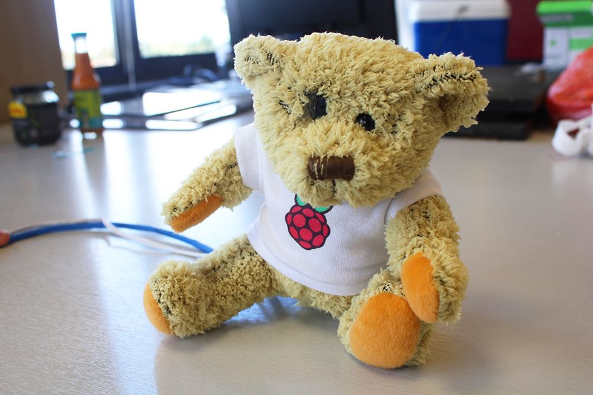

<<<<<<< HEAD
## What you will make
Make a Babbage Bear that takes photos and sends tweets!

## What you will learn
 By creating a Tweeting Babbage you will learn:

- How to use GPIO and the camera module to use a push button as a trigger to take pictures
- How to automate a Python script to run when the Raspberry Pi boots
- How to embed a Raspberry Pi inside a Babbage Bear

This resource covers elements from the following strands of the [Raspberry Pi Digital Making Curriculum](https://www.raspberrypi.org/curriculum/):
=======
## Tweeting Babbage

In this project you will turn an old cuddly toy into a Twitter bot that can post pictures to your Twitter feed at the push of a button.

By creating a tweeting Babbage you will learn how to:

- Use GPIO and a button to trigger the Camera Module
- Automate a Python script to run when the Raspberry Pi boots
- Embed a Raspberry Pi inside a Babbage Bear

This resource covers elements from the following strands of the Raspberry Pi Digital Making Curriculum:
>>>>>>> master

- [Combine programming constructs to solve a problem](https://www.raspberrypi.org/curriculum/programming/builder)
- [Combine inputs and/or outputs to create projects or solve a problem](https://www.raspberrypi.org/curriculum/physical-computing/builder)
- [Use basic materials and tools to create project prototypes](https://www.raspberrypi.org/curriculum/manufacture/creator)
<<<<<<< HEAD

=======
>>>>>>> master
