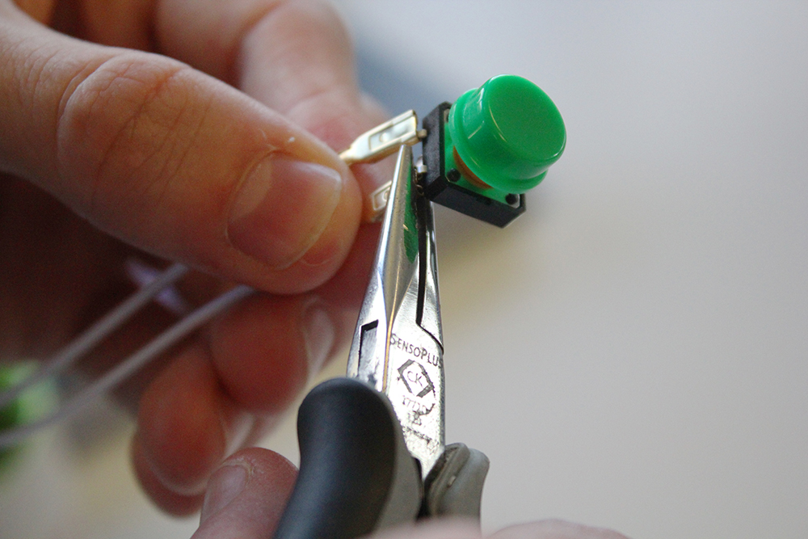
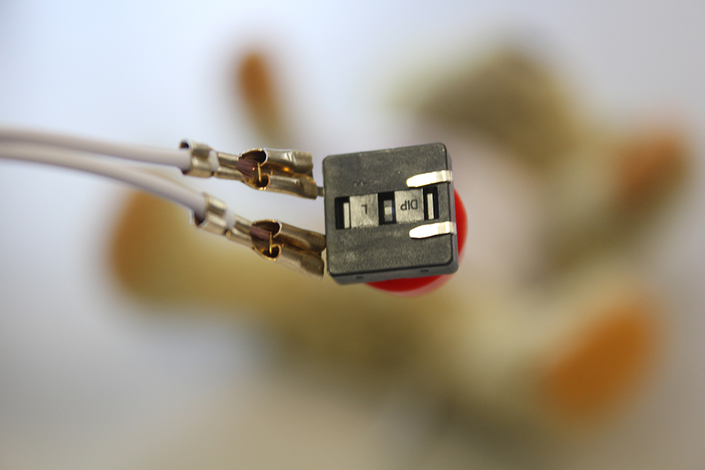
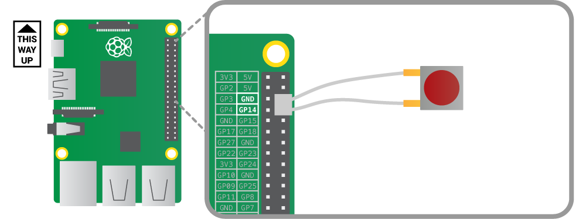
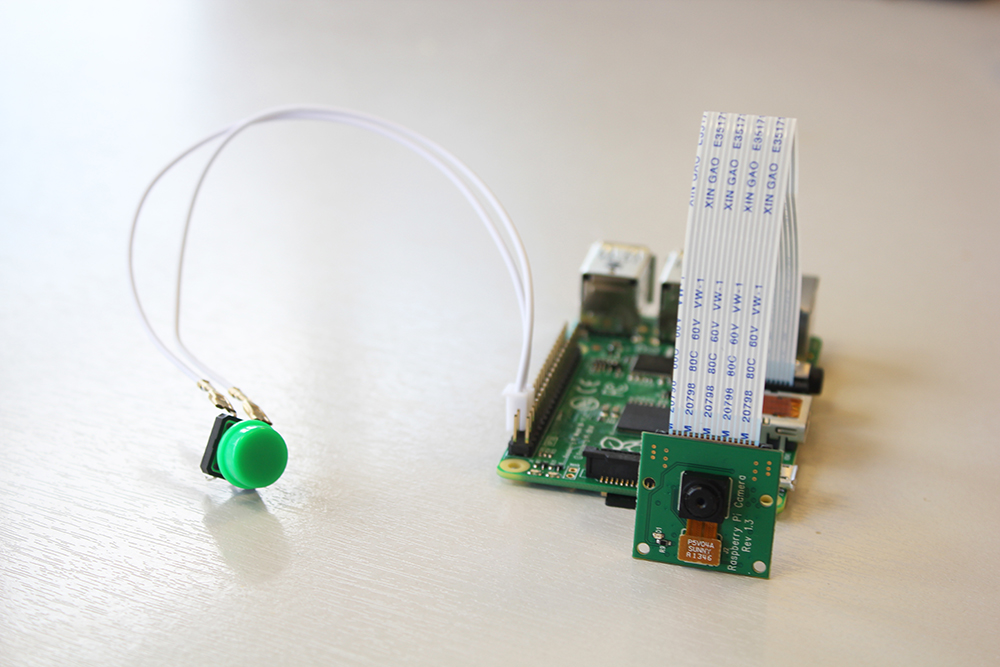

## Triggering a photo with a button

In this project, your Raspberry Pi will eventually end up being embedded inside your cuddly toy, so using a breadboard to wire up a button would be a little impractical. Instead you're going to connect it to the Pi with some quick-connect wires.

### Wiring your button

- Connect the button to the wires and attach it by clamping with a pair of pliers.
  

- Flatten the remaining two button feet.
  
  
- Wire it up to the ground pin and **GPIO 14** like so:
  
  
- With your camera connected, your finished setup should look something like this:

  

### Triggering the camera when the button is pressed

The `when_pressed` method for the `Button` class in `gpiozero` can be used to call any function you have written.

Your first step will be to create a new function called `take_photo`. Inside this function you should place code to get the timestamp, save it as a **global variable**, and take the photo. Then write code to call this function when the button is pressed. Have a look at the steps below if you are unsure about functions or triggering them with buttons.

[[[generic-python-simple-functions]]]

[[[rpi-python-function-calls-with-buttons]]]

--- hints --- --- hint ---
- In you existing script, import the `Button` class from `gpiozero`.
- Next you need to create a `Button` object set up on **GPIO 14**.
- Create a variable for the file name. It can just be an empty string for now.
- Take all the code you've written to take a photo and name it with a time stamp and place it into you `take_photo` function. Make sure that you start the function with `global filename` so it can change the value of the variable.
- Create a trigger, so that when the button is pressed the function is called.
--- /hint --- --- hint ---
Here's some partially completed code, with comments explaining what needs adding in to help you with the task:
```python
## Import the modules
from picamera import PiCamera()
from datetime import datetime
from time import sleep
from gpiozero import Button

button = Button(14)
camera = PiCamera()

filename = ''

def take_photo():
	global filename
    ## Code to get the timstamp
	## Then take a photo and save it 

## Code to trigger the function when the button is pressed

## Remove the camera.close()
```
--- /hint --- --- hint ---
Here's a video showing you how to write the code:
<iframe width="560" height="315" src="https://www.youtube.com/embed/CH1fstgfgrI" frameborder="0" allowfullscreen></iframe>
--- /hint --- --- /hints ---


