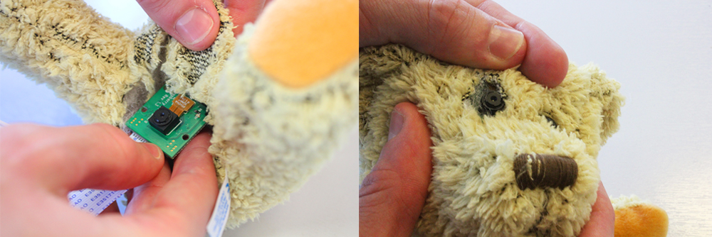

## Modding your cuddly toy

Your final step is to integrate your tweeting bot into a cuddly toy. The images below show the process with Babbage, the Raspberry Pi Foundation's mascot. You can obviously use any cuddly toy you like though.

- Take an old cuddly toy, and make an incision in its rear end with scissors. Cut all the way across the bottom from the thighs, a little more than the width of the Pi.

    

- Remove as much stuffing from the body as possible. Remove it from the head, body, and right arm, but leave the left arm and both legs.

    

- Insert the button into the cuddly toy with wires attached. Place the button inside the paw, and leave the wire trailing out. There's no need to have it attached to the Pi yet.

- Replace the arm stuffing to keep the button in place.

- Cut out the right eye with scissors. Try not to remove any fabric, just loosen the eye from the socket and remove it.

    

- Insert the unattached Camera Module into the cuddly toy, carefully positioning the camera lens so that it is pointing out of the eye socket.

    

- Replace the head stuffing behind the Camera Module to keep it in place.

- Connect the Camera Module to the Pi and wire up the push button to the pins used earlier, **GND** and **GPIO 14**. Now connect the Pi's power cable.

    

    

- With the power cable, camera, and GPIO button connected to the Pi, carefully insert the Pi into the cuddly toy so that the USB ports face the bottom end.

    

- Replace the body stuffing to pad it out.

    

- Connect the Ethernet cable or a pre-configured USB WiFi dongle.

    

- Use safety pins to close the incision over the USB ports.

    

- Connect the Pi's power supply to a wall socket (or to a battery pack) and wait for it to boot. Once it's ready, every time you press the button in the paw, the Pi will take a picture and tweet it!

Now you have a tweeting cuddly toy!

