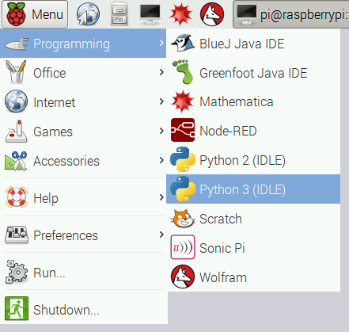

# Tweeting Babbage

Make a Babbage Bear that takes photos and sends tweets!

First of all, you'll need to set up a Twitter account, get your API keys and test the connection. Follow the [Getting Started with the Twitter API](https://www.raspberrypi.org/learning/getting-started-with-the-twitter-api/) resource before you start. If you're unfamiliar with the camera module, it's worth working through [Getting Started with Picamera](https://www.raspberrypi.org/learning/getting-started-with-picamera/).

## Take a picture with the camera module

First, you'll need to set up your camera and write the code to take a picture.

1. With the Pi switched off, connect the camera to the camera port.

    

1. Open the **File Manager** and create a new folder for your project, e.g. `tweeting-babbage`.

1. Open **Python 3 (IDLE)** from the main menu:

    

1. Now open a new window, save it as `camera.py` and enter the following code:

    ```python
    from picamera import PiCamera
    from time import sleep

    camera = PiCamera()

    camera.start_preview()
    sleep(3)
    camera.capture('/home/pi/image.jpg')
    camera.stop_preview()
    ```

    This is a test script to check you can take a picture from Python.

1. Run with `F5` and you should see a preview on the screen for three seconds before the camera takes the picture.

1. Open the File Manager and you should see `image.jpg`. Double-click the icon to open it up.

## Tweet a picture from the Pi camera

Now you'll need to copy the picamera code you just used into the `babbage.py` file, so that it will tweet the photo taken by the Pi camera.

1. First add the `import` lines at the top:

    ```python
    from picamera import PiCamera
    from time import sleep
    ```

    Imports are best kept at the top of the code before anything else.

1. Then add the `picamera` lines:

    ```python
    camera = PiCamera()

    camera.start_preview()
    sleep(3)
    camera.capture('/home/pi/image.jpg')
    camera.stop_preview()

    message = "Here's a Pi camera picture!"
    with open('/home/pi/image.jpg', 'rb') as photo:
        twitter.update_status_with_media(status=message, media=photo)
    ```

1. Now run the code; it will save the photo to `image.jpg` in the home folder and upload it to Twitter.

1. Check Twitter to see if it worked!

    

## Use a timestamp

Rather than use the hard-coded filename of `image.jpg`, you can use something more dynamic. It would be better to timestamp the filename so it will never get overwritten. It should also be stored in a folder inside your project.

1. In the File Manager, create a new folder inside `tweeting-babbage` called `photos`.

1. Import the `datetime` module by adding the line `from datetime import datetime` to the top of your script.

1. Save the timestamp as a variable before taking the picture, and pass this into the path string:

    ```python
    timestamp = datetime.now().isoformat()
    photo_path = '/home/pi/tweeting-babbage/photos/%s.jpg' % timestamp
    camera.capture(photo_path)
    ```

    The timestamp is formatted in the ISO datetime format `YYYY-MM-DDTHH:MM:SS.mmmmmm` e.g. `2014-10-02T05:10:25.642155` (year, month, day, hours, minutes, seconds, microseconds).

1. Now change the `update_status_with_media()` call to this new photo path:

    ```python
    with open(photo_path, 'rb') as photo:
        twitter.update_status_with_media(status=message, media=photo)
    ```

1. Run the code again; it should save the image in the `tweeting-babbage/photos` folder and tweet it as usual.

## Wire up a GPIO button

Now you'll add a hardware button that you'll use to trigger the camera.

1. Connect the button to the wires and attach it by clamping with a pair of pliers.

    

1. Flatten the remaining two button feet.

    

1. Wire it up to ground and GPIO pin 14 like so:

    

1. Return to the `camera.py` script to test it out. First import the Button interface from the GPIO Zero library at the top:

    ```python
    from gpiozero import Button
    ```

1. Then add a line to create a `Button` object in your code:

    ```python
    button = Button(14)
    ```

1. Now just add a `wait_for_press` before taking the picture. It should go between `start_preview()` and `capture()` - you can remove the `sleep()` for now:

    ```python
    camera.start_preview()
    button.wait_for_press()
    camera.capture(photo_path)
    ```

    The code will pause on that line until the button is pressed.

    

1. Run the code and you should see a preview of the camera picture. When you press the button it should take a picture and exit the preview.

If your button press has no effect, make sure it is wired up to the correct pins. If you can't get it to work, try pressing `Ctrl + C` while pressing the button to try to force an exit.

## Put it all together

Now that you've got the button triggering the camera, and you know you can tweet pictures taken with the camera, put it all together in `babbage.py`.

1. Add the GPIO library import and GPIO setup lines to the top.

1. Add the `wait_for_press()` line before the capture. You probably want to leave the `sleep()` in this time.

1. Press the button when the preview appears, and it should tweet the picture from the camera.

## Add continuation

Next we'll add a loop so a picture is taken every time the button is pressed.

1. Remove the preview from the code as you won't have a screen attached. Remove the `start_preview()` and `stop_preview()` lines as well.

1. Add a `while` loop to make the button press camera trigger continue indefinitely:

    ```python
    while True:
        button.wait_for_press()
        message = random.choice(messages)
        timestamp = datetime.now().isoformat()
        photo_path = '/home/pi/tweeting-babbage/photos/%s.jpg' % timestamp
        sleep(3)
        camera.capture(photo_path)

        with open(photo_path, 'rb') as photo:
            twitter.update_status_with_media(status=message, media=photo)
    ```

    Make sure all the code is indented so that it is inside the `while` loop.

## Final code

Your final code should look something like this:

```python
from twython import Twython
from picamera import PiCamera
from time import sleep
from datetime import datetime
from gpiozero import Button
import random
from auth import (
    consumer_key,
    consumer_secret,
    access_token,
    access_token_secret
)

twitter = Twython(
    consumer_key,
    consumer_secret,
    access_token,
    access_token_secret
)

button = Button(14)
camera = PiCamera()

messages = [
    "Hello world",
    "Hi there",
    "My name is Babbage",
    "What's up?",
    "How's it going?",
    "Have you been here before?",
    "Get a hair cut!",
]

while True:
    button.wait_for_press()
    message = random.choice(messages)
    timestamp = datetime.now().isoformat()
    photo_path = '/home/pi/tweeting-babbage/photos/%s.jpg' % timestamp
    sleep(3)
    camera.capture(photo_path)

    with open(photo_path, 'rb') as photo:
        twitter.update_status_with_media(status=message, media=photo)

```

But feel free to make any modifications you see fit; run the code again to check it still works. 

## Automation

Lastly, you'll need to make the Python script run as soon as the Pi boots, as you won't have a monitor attached.

1. Open the Scheduled Tasks application from the main menu.

1. Create a new scheduled task:

    - Click **New** and select **A task that launches recurrently**.
    - Enter the **Description** as `Tweeting Babbage`
    - Enter the **Command** as `python3 /home/pi/tweeting-babbage/babbage.py &`
        - **The `&` at the end of this command is important: don't forget to include it!**
    - Select **At reboot** under **Basic**
    - Click **Add** and then **OK**
    - **Exit** the Scheduled tasks window

    Now your Pi is programmed to run the program on boot.

1. Reboot the Pi without a monitor and wait for it to boot (the activity light on the Pi should stop flashing). Try pressing the button and watching it upload the picture to Twitter.

    If you have any issues, try reconnecting a monitor to see what's going on.

## Setting up the hardware

You might want to think carefully about which Raspberry Pi model you use for the deployment. These instructions use a Model B+, which does (just) fit inside a Babbage, but a Raspberry Pi Zero, or Model A+ are smaller, lower-powered and better suited to a project like this.

Other things to consider are WiFi, power, and cost.

### WiFi

Raspberry Pi 3 comes with built-in wireless connectivity, meaning you can connect to the internet without any wires. Other models do not have WiFi, but you can add a USB WiFi dongle. Alternatively you can use an Ethernet cable, but this restricts the portability of the project.

The pictures below show the Babbage connected with an Ethernet cable.

### Power

Usually, the Raspberry Pi is connected to mains power (a plug socket in the wall) with a USB power supply. Alternatively, it can be powered by a USB power bank. Note that each Raspberry Pi model has a different power usage rate. The Pi 3 is the biggest power draw, and the Model A+ and Pi Zero are the lowest. You might want to do some testing to see how long each Pi lasts on a battery pack.

The pictures below show the Babbage connected to mains power.

### Cost

While the Pi 3, Pi 2 and Model B+ are better suited to using the Pi as a desktop computer, if you intend to keep your Tweeting Babbage project running long term, you might not want to sacrifice your main Raspberry Pi. A good way to manage this is to do all your development work on your main Pi (e.g. Pi 3) and deploy to a cheaper version (e.g. Pi Zero or Model A+), which means you don't lose your main Pi, along with the power benefits this brings.

## Tweeting Babbage

Now that you have the code doing exactly what you want, you can put it into action (or into Babbage, to be more precise).

1. Take a fresh Babbage, and make an incision in its rear end with scissors. Cut all across the bottom from the thighs, a little more than the width of the Pi.

    

1. Remove as much stuffing from the body as possible. Remove it from the head, body and right arm, but leave the left arm and both legs.

    

1. Insert the button into the bear with wires attached, placing the button inside the paw, and leaving the wire trailing out. There's no need to have it attached to the Pi yet.

1. Replace the arm stuffing to keep the button in place.

1. Cut out the right eye with scissors. Try not to remove any fabric; just loosen the eye from the socket and remove it.

    

1. Insert the camera module into the bear, unattached, carefully positioning the camera lens pointing out of the eye hole.

    

1. Replace the head stuffing behind the camera module to keep it in place.

1. Connect the camera module to the Pi and wire up the push button to the pins used earlier: ground and GPIO 14. Now connect the Pi's power cable.

    

    

1. With the power, camera and GPIO button connected to the Pi, carefully insert the Pi into the bear SD card slot first, with the USB ports facing up at the bottom end.

    

1. Replace the body stuffing to pad it out.

    

1. Connect the Ethernet cable or pre-configured USB WiFi dongle.

    

1. Use safety pins to close the incision over the USB ports.

    

1. Connect the Pi's power supply to a wall socket (or connect the battery pack) and wait for it to boot. Once it's ready, every time you press the button in the paw it will take a picture and tweet it!

Now you have a Tweeting Babbage!


## What next?

- Try adding a text or image overlay to the picture before tweeting! See [Getting Started with Picamera](https://www.raspberrypi.org/learning/getting-started-with-picamera/) and the [picamera documentation](http://picamera.readthedocs.org/)
- What else could you use as the input? You could use a motion sensor (or another sensor) instead of a button
- You could use `TwythonStreamer` to take a photo when someone tweets a particular hashtag, or sends a tweet to your Babbage's Twitter account
- What else could you use as the output? You could upload to another website using a different API or display on a screen somewhere
- Try making two Babbages tweet to each other in conversation!
