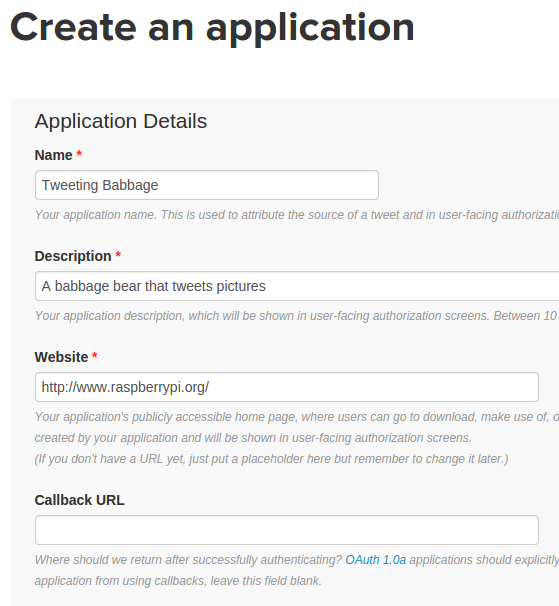
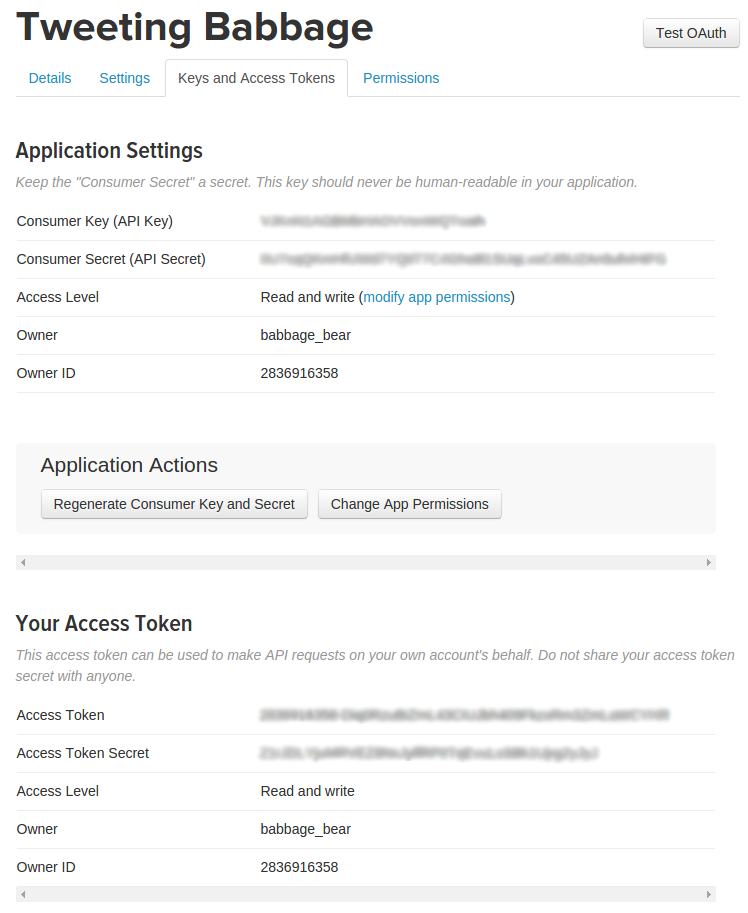
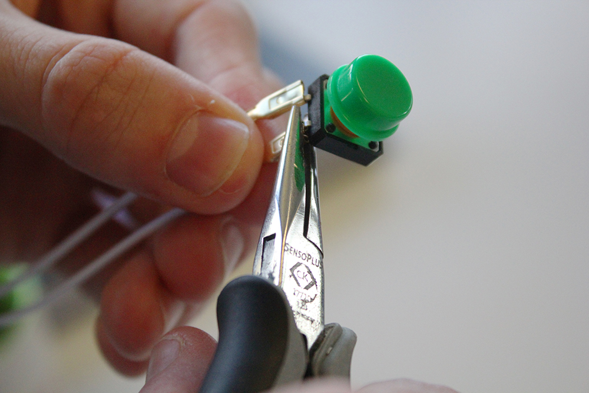
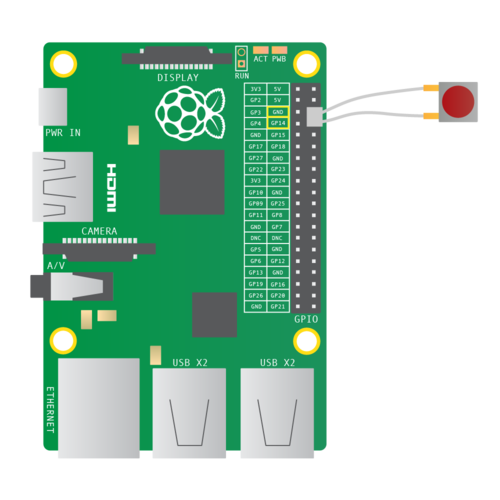
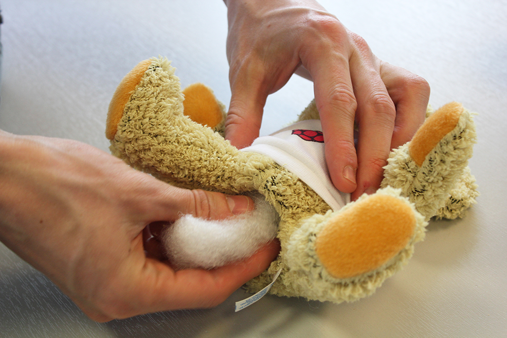
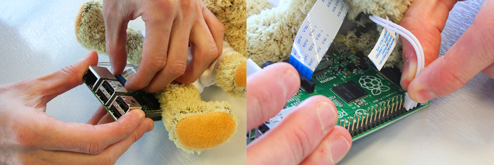
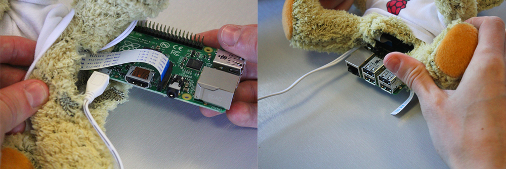
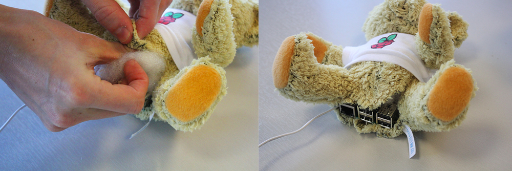
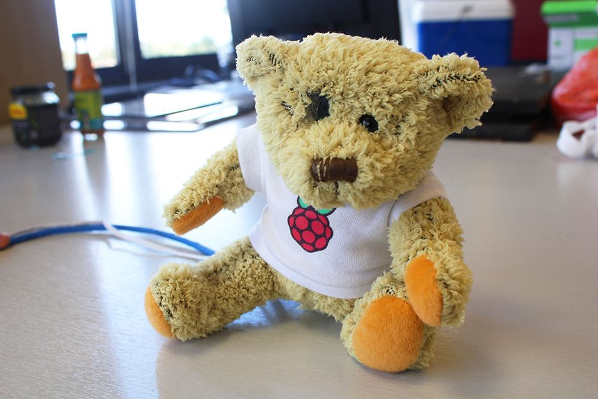

# Tweeting Babbage

Make a Babbage Bear that takes photos and sends tweets!

## Create a Twitter account

First we need to create a Twitter account to use for the project.

1. Create a Twitter account for your Babbage Bear at [twitter.com](https://twitter.com).

    

You might also want to upload a photo and fill out the bio.

## Create a Twitter application

We need to register our application with Twitter to get keys; these allow us to access the Twitter account from Python using the Twitter API (Application Programming Interface).

1. Go to [apps.twitter.com](https://apps.twitter.com) and click the **Create New App** button.

    

1. Complete the application details form. You must enter an application name, description, and website (this can be `http://www.raspberrypi.org` if you don't have one). Leave the Callback URL field blank and proceed.

    

1. Modify your app permissions from **Read only** to **Read and write**.

    

1. Click the 'Keys and Access Tokens' tab and create an access token.

1. Once you've clicked the **Create an Access Token** button, refresh the page and you'll see a new section beneath the **Application Settings** with your access token details.

1. You should now be able to see your **Consumer key**, **Consumer secret**, **Access token**, and **Access token secret**. You'll need these four keys to connect to your Twitter account from your Python code. Don't share these keys with anyone as they can be used without the account's password. If you share your code online, make sure not to include these keys. If you ever accidentally share or publish these keys, you should regenerate the keys at [apps.twitter.com](https://apps.twitter.com).



## Connect to Twitter from Python

Before we perform surgery on Babbage and insert a camera up his rear end, let's get the code doing what we want.

1. Boot your Raspberry Pi to the desktop and launch `LXTerminal`.

1. Because the Raspberry Pi doesn't have a real-time clock, we must start by setting the correct date and time on the system with the command:

    ```bash
    sudo date -s "2 OCT 2014 12:00:00"
    ```

    This is important, as without the correct time we won't be able to connect to Twitter.

1. Create a folder for your project with the following command:

    ```bash
    mkdir tweeting-babbage
    ```

1. Enter this folder with `cd tweeting-babbage` and create the files we'll be using:

    ```bash
    touch auth.py babbage.py tweeting-babbage.py
    ```

1. Launch these Python files in `IDLE3` with root permissions (you'll need this for the GPIO) with the command:

    ```
    sudo idle3 *.py &
    ```

1. In `auth.py` paste your API keys from [apps.twitter.com](https://apps.twitter.com) into variables like so:

    ```python
    consumer_key        = 'ABCDEFGHIJKLKMNOPQRSTUVWXYZ'
    consumer_secret     = '1234567890ABCDEFGHIJKLMNOPQRSTUVXYZ'
    access_token        = 'ZYXWVUTSRQPONMLKJIHFEDCBA'
    access_token_secret = '0987654321ZYXWVUTSRQPONMLKJIHFEDCBA'
    ```

1. Save `auth.py` and go to `babbage.py`. Import the `twython` library and the variables from `auth.py`:

    ```python
    from twython import Twython
    from auth import (
        consumer_key,
        consumer_secret,
        access_token,
        access_token_secret
    )
    ```

1. Make a connection with the Twitter API using this set of keys:

    ```python
    twitter = Twython(
        consumer_key,
        consumer_secret,
        access_token,
        access_token_secret
    )
    ```

1. Create a `main()` function which will be called when the script is run. We'll start with a basic "Hello world" tweet to test the connection works:

    ```python
    def main():
        message = "Hello world!"
        twitter.update_status(status=message)
    ```

    This uses the API's `update_status()` function to send a tweet containing the text "Hello world!".

1. We'll also add an instruction at the end to run the `main()` method when the script is called directly:

    ```python
    if __name__ == '__main__':
        main()
    ```

    Your code should now look like this:

    ```python
    from twython import Twython
    from auth import (
        consumer_key,
        consumer_secret,
        access_token,
        access_token_secret
    )

    def main():
        message = "Hello world!"
        twitter.update_status(status=message)
        print("Tweeted: %s" % message)

    if __name__ == '__main__':
        main()
    ```

1. Now save (`Ctrl + S`) and run with `F5`. You should see the message "Tweeted: Hello world!". Go to your Twitter profile in a web browser to verify it was sent! This will be at `twitter.com/username`, where `username` is your Twitter account's username.


Note that sending multiple tweets with the exact same text are classed as duplicates and rejected by Twitter. If you want to test it again, try tweeting a different message.

If you see an error, your API keys may be incorrect. Be sure to copy them exactly and check the spelling of the variables. You should also check that your Pi is online.


## Tweet random messages

Now that we can send some text as a tweet, let's mix it up a bit.

1. First, import the random module:

    ```python
    import random
    ```

    This module contains a `choice` function which takes a list and returns a single entry at random.

1. Now create a list of messages like so:

    ```python
    messages = [
        "Hello world",
        "Hi there",
        "My name is Babbage",
        "What's up?",
        "How's it going?",
        "Have you been here before?",
        "Get a hair cut!",
    ]
    ```

1. Replace `message = "Hello world!"` with `message = random.choice(messages)`.
    
    This chooses a single item from the `messages` list at random.

1. Run the code again two or more times to see different messages being tweeted at random.

## Tweet a picture

Now that the Twitter connection has been tested, let's try to upload a picture. Rather than try to hook up the camera now, we'll test it independently.

1. Find a picture, copy it to your Raspberry Pi or download it from the internet, and save it to your home folder. Make a note of its location (something like `/home/pi/Downloads/image.jpg`).

1. Modify the `main()` function in the code accordingly:

    ```python
    message = "Hello world - here's a picture!"
    with open('/home/pi/Downloads/image.jpg', 'rb') as photo:
        twitter.update_status_with_media(status=message, media=photo)
    ```

    Make sure to specify the full path to the image correctly.

    This opens the file and uses the `update_status_with_media()` function to upload the image, along with the tweet text.

1. Run the code and see if it tweets the text and image together!

    

## Take a picture with the Pi camera

Now that we know we can upload a given picture to Twitter, let's take one with the Pi camera.

1. With the Pi switched off, connect the camera to the camera port.

    

1. Boot the Pi and from the command line or LXTerminal test that it works with the command `raspistill -k`. If you see the camera's image on the screen, you know it's working. Press `Ctrl + C` to exit the preview.

1. Now open a new Python window in IDLE3, save as `camera.py` and enter the following code:

    ```python
    from picamera import PiCamera
    from time import sleep

    with PiCamera() as camera:
        camera.start_preview()
        sleep(3)
        camera.capture('/home/pi/image.jpg')
        camera.stop_preview()
    ```

    This is a test script to check we can take a picture from Python.

1. Run with `F5` and you should see a preview on the screen for 3 seconds before the camera takes the picture.

1. Open the file manager and you should see `image.jpg`. Double-click the icon to open it up.

## Tweet a picture from the Pi camera

Now we'll copy the `picamera` code we just used into the `babbage.py` file, so that it will tweet the photo taken by the Pi camera.

1. First add the `import` lines at the top:

    ```python
    from picamera import PiCamera
    from time import sleep
    ```

    Imports are best kept at the top of the code before anything else.

1. Then add the `picamera` lines in the `main()` method:

    ```python
    with PiCamera() as camera:
        camera.start_preview()
        sleep(3)
        camera.capture('/home/pi/image.jpg')
        camera.stop_preview()

        message = "Here's a Pi camera picture!"
        with open('/home/pi/image.jpg', 'rb') as photo:
            twitter.update_status_with_media(status=message, media=photo)
    ```

1. Now run the code; it will save the photo to `image.jpg` in the home folder and upload it to Twitter.

1. Check Twitter to see if it worked!

    

## Use a timestamp

Now let's fix the hard-coded filename of `image.jpg` and use something more dynamic. It would be better to timestamp the filename so it will never get overwritten. It should also be stored in a folder inside our project.

1. In the terminal window, create a new folder inside `twitter-babbage` called `photos` with `mkdir photos`.

1. Import the `datetime` function with `from datetime import datetime`.

1. Save the timestamp as a variable before taking the picture, and pass this into the path string:

    ```python
    timestamp = datetime.now().isoformat()
    photo_path = '/home/pi/tweeting-babbage/photos/%s.jpg' % timestamp
    camera.capture(photo_path)
    ```

    The timestamp is formatted in the ISO datetime format `YYYY-MM-DDTHH:MM:SS.mmmmmm` e.g. `2014-10-02T05:10:25.642155` (year, month, day, hours, minutes, seconds, microseconds).

1. Now change the `update_status_with_media()` call to this new photo path:

    ```python
    with open(photo_path, 'rb') as photo:
        twitter.update_status_with_media(status=message, media=photo)
    ```

1. Run the code again; it should save the image in the `tweeting-babbage/photos` folder and tweet it as usual.

## Wire up a GPIO button

Now we'll add a hardware button that we'll use to trigger the camera.

1. Connect the button to the wires and attach it by clamping with a pair of pliers.

    

1. Flatten the remaining two button feet.

    

1. Wire it up to ground and GPIO pin 14 like so:

    

1. Return to the `camera.py` script to test it out. First import the GPIO library at the top:

    ```python
    import RPi.GPIO as GPIO
    ```

1. Then add some lines between the imports and the main code to set up the GPIO pins:

    ```python
    GPIO.setmode(GPIO.BCM)
    GPIO.setup(14, GPIO.IN, GPIO.PUD_UP)
    ```

    This configures the code to use the Broadcom (`BCM`) pin numbering system (as opposed to `BOARD`). and sets up GPIO pin 14 as an input.

1. Now just add the button press trigger before taking the picture. It should go between `start_preview()` and `capture()` - you can remove the `sleep()` for now:

    ```python
    camera.start_preview()
    GPIO.wait_for_edge(14, GPIO.FALLING)
    camera.capture(photo_path)
    ```

    `GPIO.wait_for_edge()` is the trigger; it means "wait for an input on pin 14". The code will pause on that line until it receives a button press.

    

1. Run the code and you should see a preview of the camera picture. When you press the button it should take a picture and exit the preview.

If your button press has no effect, make sure it is wired up to the correct pins. If you can't get it to work, try pressing `Ctrl + C` while pressing the button to try to force an exit.

## Put it all together

Now that we've got the button triggering the camera, and we know we can tweet pictures taken with the camera, let's put it all together in `babbage.py`.

1. Add the GPIO library import and GPIO setup lines to the top.

1. Add the `wait_for_edge()` line before the capture. You probably want to leave the `sleep()` in this time.

1. Press the button when the preview appears, and it should tweet the picture from the camera.

## Add continuation

Next we'll add a loop so a picture is taken every time the button is pressed.

1. Remove the preview from the code as we won't have a screen attached. Remove the `start_preview()` and `stop_preview()` lines as well.

1. Add a `while` loop to make the button press camera trigger continue indefinitely:

    ```python
    with PiCamera() as camera:
        while True:
            GPIO.wait_for_edge(14, GPIO.FALLING)
            timestamp = datetime.now().isoformat()
            photo_path = '/home/pi/tweeting-babbage/photos/%s.jpg' % timestamp
            sleep(3)
            camera.capture(photo_path)

            with open(photo_path, 'rb') as photo:
                twitter.update_status_with_media(status=message, media=photo)
    ```

    Make sure all the code is indented to be inside the `while` loop.

## Final code

Your final code should look something like this:

```python
from twython import Twython
from picamera import PiCamera
from time import sleep
from datetime import datetime
import RPi.GPIO as GPIO
import random
from auth import (
    consumer_key,
    consumer_secret,
    access_token,
    access_token_secret
    )

GPIO.setmode(GPIO.BCM)
GPIO.setup(14, GPIO.IN, GPIO.PUD_UP)

twitter = Twython(
    consumer_key,
    consumer_secret,
    access_token,
    access_token_secret
)

messages = [
    "Hello world",
    "Hi there",
    "My name is Babbage",
    "What's up?",
    "How's it going?",
    "Have you been here before?",
    "Get a hair cut!",
]

def main():
    message = random.choice(messages)

    with PiCamera() as camera:
        while True:
            GPIO.wait_for_edge(14, GPIO.FALLING)
            timestamp = datetime.now().isoformat()
            photo_path = '/home/pi/tweeting-babbage/photos/%s.jpg' % timestamp
            sleep(3)
            camera.capture(photo_path)

            with open(photo_path, 'rb') as photo:
                twitter.update_status_with_media(status=message, media=photo)

if __name__ == '__main__':
    main()
```

But feel free to make any modifications you see fit!

Test that it works by navigating to the `tweeting-babbage` folder in the terminal with `cd` and running `sudo python3 babbage.py`. Press `Ctrl + C` to exit.

## Automation

Lastly, we'll make the Python script run as soon as the Pi boots, as we won't have a monitor attached.

1. Open the `rc.local` file for editing from the command line:

    ```bash
    sudo nano /etc/rc.local
    ```

1. Go down to the end of the file and add the following line just before the final line `exit 0`:

    ```
    python3 /home/pi/tweeting-babbage/babbage.py &
    ```

    This runs the script when the Pi boots. The ampersand (&) is important as it makes the script run in a separate process, so that the Pi can continue to boot.

1. Save and exit with `Ctrl + O`, `Enter` and `Ctrl + X`.

1. Reboot the Pi without a monitor and wait for it to boot (the activity light on the Pi should stop flashing). Try pressing the button and watching it upload the picture to Twitter.

    If you have issues, try reconnecting a monitor to see what's going on.

## Tweeting Babbage

Now that we have the code doing exactly what we want, let's put it into action (or into Babbage, to be more precise).

1. Take a fresh Babbage, and make an incision in its rear end with scissors. Cut all across the bottom from the thighs, a little more than the width of the Pi.

    

1. Remove as much stuffing from the body as possible. Remove it from the head, body and right arm, but leave the left arm and both legs.

    

1. Insert the button into the bear with wires attached, placing the button inside the paw, and leaving the wire trailing out. There's no need to have it attached to the Pi yet.

1. Replace the arm stuffing to keep the button in place.

1. Cut out the right eye with scissors. Try not to remove any fabric; just loosen the eye from the socket and remove it.

    

1. Insert the camera module into the bear, unattached, carefully positioning the camera lens pointing out of the eye hole.

    

1. Replace the head stuffing behind the camera module to keep it in place.

1. Connect the camera module to the Pi and wire up the push button to the pins used earlier: ground and GPIO 14. Now connect the Pi's power cable.

    

    

1. With the power, camera and GPIO button connected to the Pi, carefully insert the Pi into the bear SD card slot first, with the USB ports facing up at the bottom end.

    

1. Replace the body stuffing to pad it out.

    

1. Connect the Ethernet cable or pre-configured USB WiFi dongle.

    

1. Use safety pins to seal the incision wound over the USB ports.

    

1. Connect the Pi's power supply to a wall socket and wait for it to boot. Once it's ready, every time you press the button in the paw it will take a picture and tweet it!

Now you have a Tweeting Babbage!


